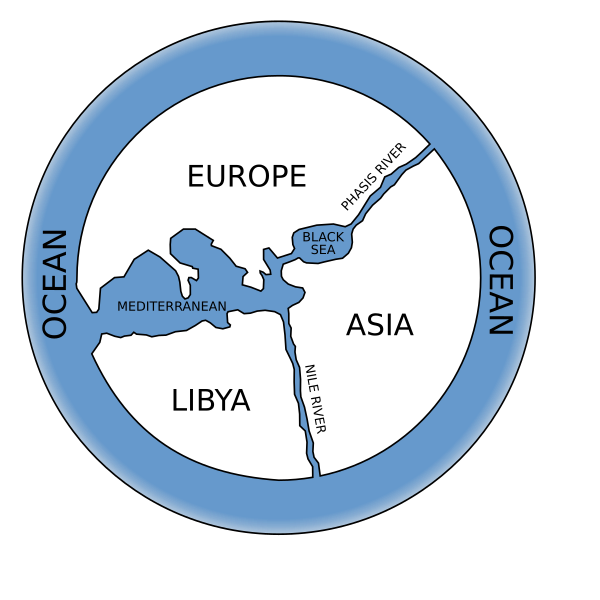
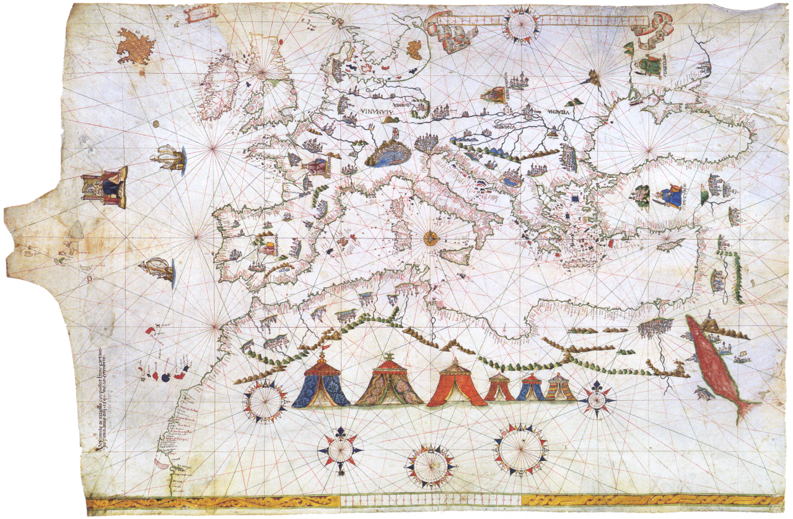
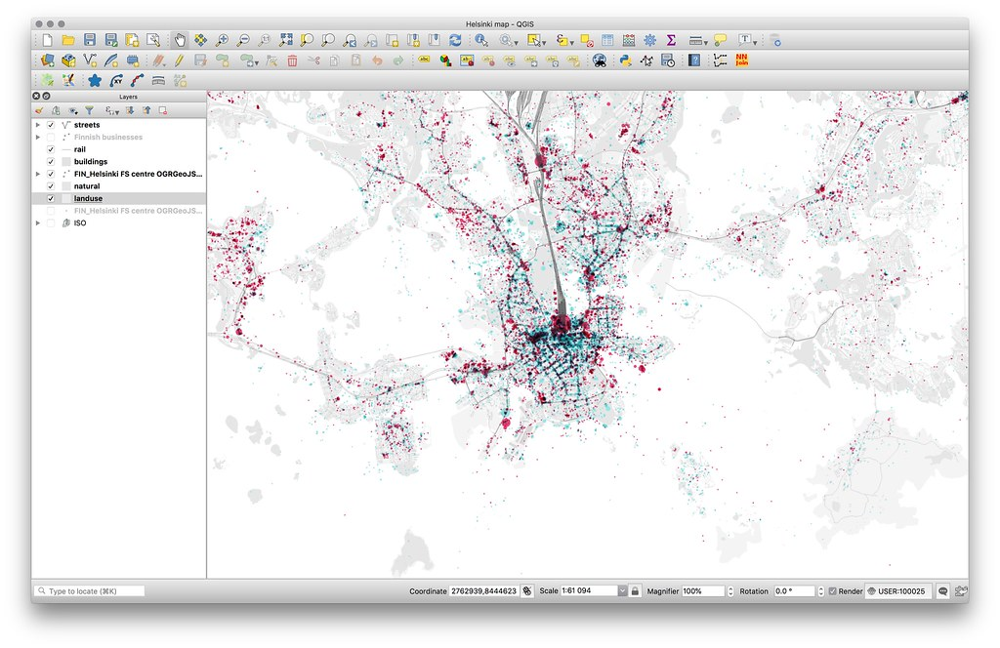

# A history of GIS {-}

Humans have always been interested in mapping out the Earth.
Anaximander was among the first to publish a map of the known world in the 6th century BC.

```{r anaximander, echo=FALSE, fig.cap="Reconstruction of the map of the known world from Anaximander."}

```

It was not until the "Age of Exploration", where accurate maps could make the difference between riches and starving at sea, that such Tolkien-like style maps became more realistic.
 
```{r portolan, echo=FALSE, fig.cap="A *portolan* map from the Age of Discovery."}

```

Jump forward another 400 years and many major technological advancements and we get to the Information Age, where cartographic software started to be developed.
GIS comprise both the hardware and the software to collect, store, manage, and analyze geographic data.
Today, there are several GIS hardware and software that are publicly accessible and that are used in many fields: urban planning, climate modeling, mining, warfare, etc.
It may be surprising for an ecologist, but current GIS tools are tightly linked to mineral and oil exploration, such as the European Petroleum Survey Group (EPSG), and to warfare, such as GPS and GLONASS.
Nevertheless, we will use GIS for the well-being of humanity and stick to biogeographic analyses.

```{r qgis, echo=FALSE, fig.cap="An example map produced using QGIS, a free GIS software."}

```
